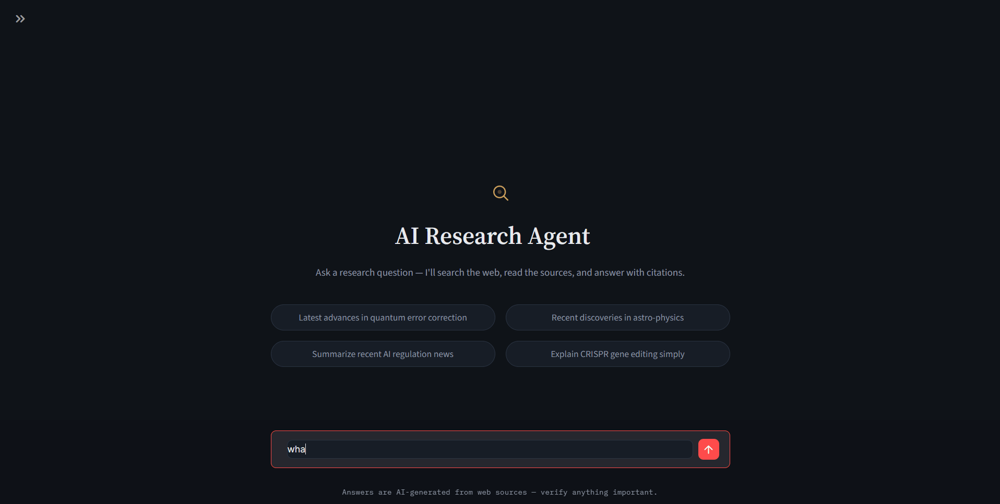

# 🔎 AI Research Intelligence Agent

A Live, Full-stack, multi-agent research assistant that plans a query, searches the live web, retrieves grounded context, and streams a cited answer back to the user — built end-to-end as a portfolio project for AI/LLM engineering roles.


   <p align="center">
     
   </p>

---

## Table of Contents
- [Overview](#overview)
- [Live Demo](#live-demo)
- [Screenshots](#screenshots)
- [Architecture](#architecture)
- [Key Features](#key-features)
- [Tech Stack](#tech-stack)
- [Project Structure](#project-structure)
- [How It Works](#how-it-works)
- [Data & Persistence](#data--persistence)
- [API Reference](#api-reference)
- [Getting Started](#getting-started)
- [Engineering Highlights](#engineering-highlights)
- [What I Learned](#what-i-learned)
- [Known Limitations & Roadmap](#known-limitations--roadmap)
- [License](#license)
- [Author](#author)

---

## Overview

You ask a research question. The agent:
1. **Breaks it down** into focused sub-topics and search-ready keyword queries.
2. **Searches the live web** for each sub-topic concurrently.
3. **Decides deterministically** whether it found enough — and digs deeper only where needed.
4. **Cleans and embeds** what it found into a short-lived vector store.
5. **Retrieves and streams** back a direct, cited answer.

Every step is logged to Postgres, so any run can be replayed and audited after the fact. The app is fully Dockerized and deployed publicly, allowing it to be demoed without requiring VPN access or IP whitelisting.

## Live Demo

- **Chat UI:** https://cosponsor-womb-snugly.ngrok-free.dev
- **API:** http://13.127.207.140:8000 (see [API Reference](#api-reference))

> ⚠️ *Note: This is running on a time-limited AWS free-tier instance for demo purposes, so it may go offline after the credit period ends.*

## Screenshots

<table>
  <tr>
    <td width="33%"><br><p align="center">Landing Page</p></td>
    <td width="33%"><br><p align="center">Streaming Answer</p></td>
    <td width="33%"><br><p align="center">Sources Panel</p></td>
  </tr>
</table>

## Architecture

```text
User Query
   ↓
Structural Validation        (reject empty / too short / gibberish input)
   ↓
Conversation Memory Management (rolling window of recent turns + auto-summary, via LangGraph checkpoint)
   ↓
Query Optimization           (LLM planner → sub-topics + dense keyword queries, resolved against conversation history)
   ↓
Topic Validity Check         (bail out early if the topic doesn't exist)
   ↓
Concurrent Web Search        (Tavily, one thread per sub-query)
   ↓
Sufficiency Check + Escalation   (fetch full pages only for thin sources)
   ↓
Content Cleaning             (strip boilerplate, dedupe, drop junk)
   ↓
Vector Ingestion             (ChromaDB, scoped to this exact query)
   ↓
Context Retrieval            (per sub-query similarity search)
   ↓
Streaming Answer Generation  (Groq LLM, grounded + cited)
   ↓
Cited Answer + Cleanup
```
*The first six stages run inside a **LangGraph** state machine; the rest is orchestrated by the pipeline layer around it.*

## Key Features

- 🧠 **LLM-driven query planning** — Turns a natural-language question into sub-topics, a comparison axis, and dense keyword queries tuned for both web search and vector retrieval.
- ⚡ **Concurrent multi-source web search** — Via the Tavily API, with a curated exclude-list for low-quality domains.
- ⚖️ **Deterministic sufficiency checks** — A non-LLM rule decides if enough content was gathered, escalating to full-page fetches only for specific thin sources.
- 🧹 **Robust content cleaning** — Strips navigation/boilerplate text, repeated spam lines, citation clutter, and near-duplicate documents before reaching the model.
- 🛡️ **Contamination-free retrieval** — Every chunk is tagged with `query_id` and `session_id`, ensuring context never leaks between questions.
- 💬 **Streaming, cited answers** — Tokens stream to the UI over SSE. Every claim is attributed inline, hedged language is preserved, and disagreements between sources are surfaced.
- 🧵 **Multi-turn conversational memory** — Follow-up questions (pronouns, "what about...", multi-hop comparisons) are resolved using a LangGraph-checkpointed rolling window of the last few turns plus an auto-summarized history of everything older, so context isn't lost as a conversation grows.
- 🗄️ **Full audit trail** — Every query, document, source, and search action is logged to Postgres.
- 🗑️ **Ephemeral vector store** — ChromaDB acts as scratch space and is wiped per query right after the answer is generated.
- 🚀 **One-click public demo** — Dockerized and deployed on AWS for seamless recruiter access.

## Tech Stack

| Layer | Technology |
|---|---|
| **Backend API** | FastAPI 0.139 + Uvicorn |
| **Orchestration** | LangGraph 1.2, LangChain |
| **LLM Inference** | Groq API (Qwen models) |
| **Web Search** | Tavily API |
| **Vector Store** | ChromaDB + `BAAI/bge-base-en-v1.5` embeddings |
| **Relational DB** | PostgreSQL (hosted on Neon) |
| **Frontend** | Streamlit, SSE token streaming |
| **Containerization** | Docker + Docker Compose |
| **Cloud** | AWS EC2 (`ap-south-1`) |
| **CI / CD** | GitHub Actions (ruff, mypy, pytest, Docker build) |

## Project Structure

```text
app/
├── agent/
│   ├── parser.py           # Extracts sources + raw docs from search results
│   ├── pipeline.py         # End-to-end orchestration
│   ├── search_agent.py     # LangGraph state machine
│   └── search_tool.py      # Tavily search & full-page extraction
├── api/
│   └── routes.py           # FastAPI routes: /research, /stream, /health, /history
├── db/
│   ├── models.py           # SQLAlchemy schema
│   ├── queries.py          # DB read/write helpers
│   └── session.py          # Engine/session setup (Neon-aware pooling)
├── rag/
│   ├── chain.py            # Retrieval + prompt + streaming LLM chain
│   └── ingestor.py         # Chunking + embedding into ChromaDB
├── static/
│   └── streamlit_app.py    # Chat frontend
└── utils/
    └── cleaner.py          # Boilerplate/duplicate removal
scripts/
├── demo_rag.py
└── search_demo.py
tests/
├── test_cleaner.py
├── test_parser.py
└── test_pipeline.py
```

## How It Works

1. **Structural Check** — Rejects empty, too-short, or non-alphabetic input before any LLM call to save tokens.
2. **Conversation Memory Management** — Keeps the last 4 raw turns of a session in the LangGraph checkpoint as-is, and folds anything older into a running summary, so long conversations stay bounded without losing earlier context.
3. **Query Optimization** — An LLM planner reads that summary plus the recent turns (not just the latest message), resolves pronouns and follow-up references into a standalone question, then splits it into 2–3 sub-topics and writes dense keyword queries optimized for both live web and similarity search.
4. **Validity Check** — Stops immediately if the planner judges the topic doesn't genuinely exist.
5. **Web Search** — Sub-queries run concurrently against Tavily. Results are deduplicated by URL and low-quality domains are filtered out.
6. **Sufficiency Check & Escalation** — If snippet content isn't enough, only the thinnest individual sources get a full-page fetch, keeping costs scaled to what's actually missing.
7. **Cleaning** — Raw text is stripped of boilerplate, spam, and near-duplicates to keep only substantive content.
8. **Ingestion** — Cleaned text is chunked and embedded into ChromaDB, tagged with `query_id` and `session_id`.
9. **Retrieval** — Each sub-query independently retrieves its most relevant chunks, which are then merged and deduplicated.
10. **Answer Generation** — A Groq-hosted LLM streams the answer token-by-token, grounded strictly in context, with inline `(Source: domain.com)` citations. The finished answer is then written back into the same checkpointed thread, so it's available as context for the next turn.
11. **Cleanup** — The query's vectors are deleted from ChromaDB. Postgres keeps the permanent record.

## Data & Persistence

- **PostgreSQL (Neon):** Four tables give full traceability:
  - `queries` — Question text, status, and errors.
  - `documents` — Raw and cleaned text per source.
  - `sources` — Citation snippets shown to the user.
  - `agent_actions` — Search sub-queries and returned URLs.
- **ChromaDB:** Transient, per-query scratch space for retrieval.
- **LangGraph Checkpoint (SQLite):** The single source of truth for conversation memory. Holds the last 4 raw turns of a session plus a rolling summary of everything older; read before every question is optimized and updated with the final answer right after — no separate in-memory cache involved.

## API Reference

| Endpoint | Method | Description |
|---|---|---|
| `/research` | POST | Runs the full pipeline, returns complete answer as JSON |
| `/research/stream` | POST | Streamed as Server-Sent Events (`session`, `token`, `done`, `error`) |
| `/health` | GET | Checks database and vector store connectivity |
| `/history` | GET | Returns recent query history |

**Request body:**
```json
{
  "query": "your research question",
  "session_id": "optional-existing-session-id"
}
```

## Getting Started

### Prerequisites
- Python 3.12+
- Docker & Docker Compose
- API Keys: [Groq](https://console.groq.com), [Tavily](https://tavily.com), and a Postgres connection string (e.g., [Neon](https://neon.tech))

### Environment Variables
Create a `.env` file in the project root:
```env
DATABASE_URL=postgresql://...
GROQ_API_KEY=...
TAVILY_API_KEY=...
```
*(Note: Neon connection strings must start with `postgresql://`)*

### Run with Docker (Recommended)
```bash
docker compose up --build
```
- **Backend:** http://localhost:8000
- **Frontend:** http://localhost:8501

### Local Development
```bash
uv sync
uv run uvicorn app.api.routes:app --reload --port 8000
uv run streamlit run app/static/streamlit_app.py
```

## Engineering Highlights

- **Retrieval Contamination** — Initially, filtering ChromaDB by `session_id` let chunks leak between unrelated questions. This was fixed by binding `query_id` to ingestion metadata and retrieval filters.
- **Cross-Request State Leakage** — Module-level mutable variables caused data bleeding in long-running processes. All per-run state now securely lives inside LangGraph's `AgentState`.
- **Neon's 5-Minute Autosuspend** — Silent connection drops were fixed by tuning the SQLAlchemy connection pool (`pool_pre_ping` + `pool_recycle`) to proactively retire stale connections.
- **Sufficiency ≠ Volume** — Early versions judged content purely by character count. The current logic escalates only specific thin sources instead of assuming "more text = relevant text."
- **Fragile One-Turn Memory** — Follow-up questions originally depended on a hand-rolled dictionary holding just the previous Q&A, and the query optimizer only ever read the single latest message regardless of what else was stored. Replaced both with a LangGraph-checkpointed rolling window (last 4 turns) plus an auto-summarized history, so the planner can resolve pronouns and multi-hop references across an entire conversation instead of one turn back.

## What I Learned
The most challenging part of building this project was improving the quality of the agent's generated answers. Even a small change in one component rippled through every other stage, requiring deliberate, well-considered iteration.

Most of my time went into the query decomposer and optimizer. Comparing approaches made it clear how much additional engineering industrial-grade optimization requires. I focused on building the strongest version achievable for a single developer, learning that quality improvements don't have a natural stopping point, Part of the engineering discipline is deciding where to draw the line and documenting known limitations.

## Known Limitations & Roadmap
- Conversation memory lives in a LangGraph SQLite checkpoint that isn't yet on a persisted volume, so it won't survive a container rebuild (only a plain restart).
- Tavily's `time_range` filters by index freshness, not actual publish date.
- Currently running on a single EC2 instance without load balancing.
- **Planned:**
  - Move the conversation checkpoint onto a persisted volume (or Postgres) so memory survives redeploys.
  - Surfacing search-progress events to the frontend UI.
  - Evaluation harness for retrieval quality.
  - JWT authentication for per-user session isolation and rate limiting.
  - Model comparison toggle (GPT-4o-mini vs Gemini Flash vs Claude Haiku).

## License
MIT License

## Author

**Omsingh Bais**

Built as a hands-on portfolio project to demonstrate production-grade AI/LLM engineering, multi-agent orchestration, RAG pipeline design, and cloud deployment.

*[GitHub](https://github.com/OmsinghThakur09) | [LinkedIn](https://www.linkedin.com/in/omsingh-bais-77312b22a/)*
